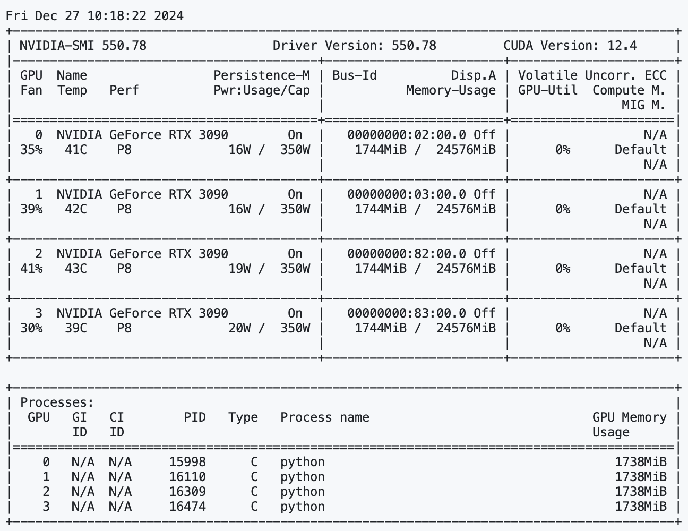

基于 ws 协议的 TTS 服务并发压力测试.

> 需要 `F5-TTS` 环境

+ 服务端启动，简单实现负载均衡   4,4: 4个实例部在4个GPU
```python
bash ./service.sh "4,4"
```

+ 客户端启动测试   负载均衡服务是 4,4，模拟请求12并发
```python
python -m stressTest.client 4,4 12
```

+ 测试维度：

```python
[DEBUG] total_time: 11.64s
[STATS] 平均响应时间: 8.72s
[STATS] 吞吐量: 1.03 请求/秒
[STATS] GPU 负载均值: 67.16%
[STATS] GPU 负载峰值: 100%
[STATS] GPU 显存峰值: 1986 MB
[STATS] 成功率: 100.00%
```




